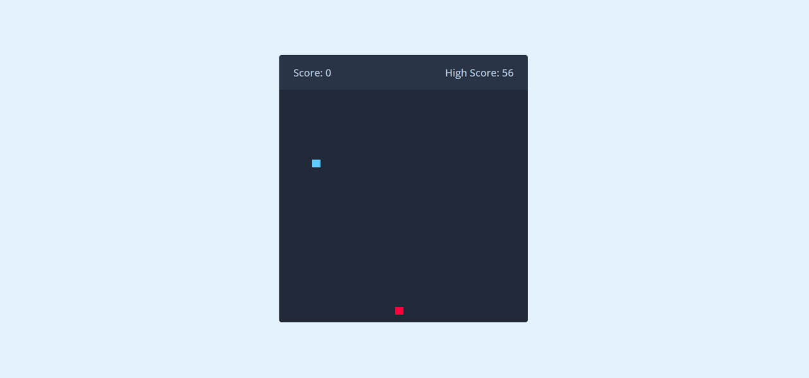

# 🐍 Snake Game

Простая и увлекательная игра "Змейка", созданная с помощью **HTML**, **CSS** и **JavaScript**. Игра адаптирована под мобильные и десктопные устройства, поддерживает управление с клавиатуры и кнопок на экране, а также сохраняет рекорд между сессиями.



---

## 🚀 Демо

👉 [Играть онлайн](https://LyashenA.github.io/snake-game/)

---

## 📦 Состав проекта

- `index.html` — разметка страницы и элементы управления.
- `style.css` — стили игры: поле, змейка, еда, pop-up "Конец игры".
- `script.js` — игровая логика: движение, еда, столкновения, рекорд и управление.

---

## 🕹️ Управление

- **Стрелки клавиатуры** — движение змейки (на компьютере).
- **Кнопки на экране** — управление на мобильных устройствах.

---

## 📌 Особенности

- ✅ Классическая механика игры "Змейка"
- ✅ Сохраняется рекорд в `localStorage`
- ✅ Управление с клавиатуры и кнопок
- ✅ Поддержка адаптивной вёрстки
- ✅ Popup при завершении игры
- ✅ Простой и понятный интерфейс

---

## 📥 Как запустить

1. Скачай или клонируй репозиторий:
   ```bash
   git clone https://github.com/LyashenA/snake-game.git
